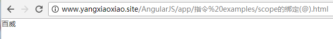
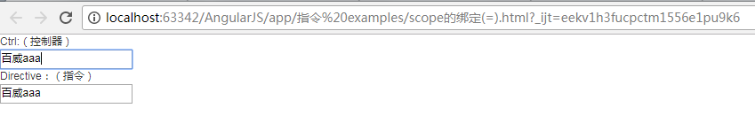
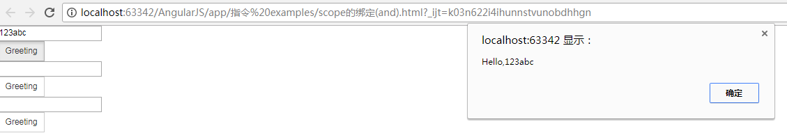

# MVC 
（Angular\app\examples下有详细README笔记）

 控制器修改数据模型，然后数据模型的变更会反映到视图上

[简单例子](https://xiaoxiaohappy.github.io/AngularJS/app/examples/HelloAngular_MVC.html)

[自定义标签](https://xiaoxiaohappy.github.io/AngularJS/app/examples/HelloAngular_Directive.html)

[数据模型](https://xiaoxiaohappy.github.io/AngularJS/app/examples/HelloAngular_TwoWayDataBinding.html)
# 模块化Module  
（Angular\app\examples下有详细README笔记）
# 指令系统
  可以自定义标签
  Angular是从ng-app（相当于C语言的main）处启动的，在任何一个单页html中，只能有一个ng-app

 

[最简单的hello,用的directive](https://xiaoxiaohappy.github.io/AngularJS/app/指令%20examples/HelloAngular_Directive.html)

[不能让几个标签之间互相影响，要在js文件中书写directive的部分加scope:{},这是独立scope](https://xiaoxiaohappy.github.io/AngularJS/app/指令%20examples/独立scope.html)

<h6> scope的绑定：

1.@,@绑定传递的是字符串,把当前属性值作为字符串传递，还能绑定来自外层的scope的值，在属性值中插入{{}}就行

2.= 与父scope中的属性进行双向绑定

3.& 传递一个来自父scope的函数，稍后调用

[关于内置指令和自定义的指令的一些例子（代码中有关键注释笔记）](https://github.com/xiaoxiaohappy/AngularJS/tree/master/app/%E6%8C%87%E4%BB%A4%20examples)

[指令与指令、指令与控制器一些例子（代码中有关键注释笔记），均需要打开F12进行观察结果](https://github.com/xiaoxiaohappy/AngularJS/tree/master/app/%E6%8C%87%E4%BB%A4%20examples)

[最简单的hello,用的directive](https://xiaoxiaohappy.github.io/AngularJS/app/指令%20examples/HelloAngular_Directive.html)

[最简单的hello,用的directive](https://xiaoxiaohappy.github.io/AngularJS/app/指令%20examples/HelloAngular_Directive.html)

# 双向数据绑定
  视图和数据是对应的

[表单](https://xiaoxiaohappy.github.io/AngularJS/app/form_数据双向绑定.html)

[css](https://xiaoxiaohappy.github.io/AngularJS/app/css_数据双向绑定.html.html)

[css升级(ng-class)](https://xiaoxiaohappy.github.io/AngularJS/app/css(升级ng-class)_数据双向绑定.html)

[ng-show（表单）](https://xiaoxiaohappy.github.io/AngularJS/app/ng-show_数据双向绑定.html)

## Angular路由

angular自己有路由(angular-route.js)，但是深层嵌套路由会很麻烦

深层嵌套路由可以借助[angular-ui中的Router](http://angular-ui.github.io)

调试工具：
chrome的扩展程序：Batarang

