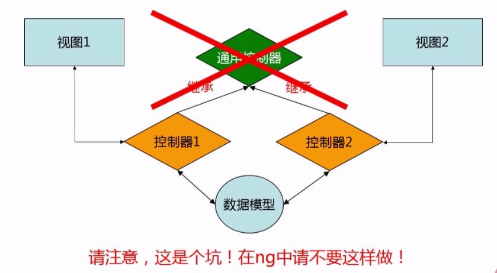
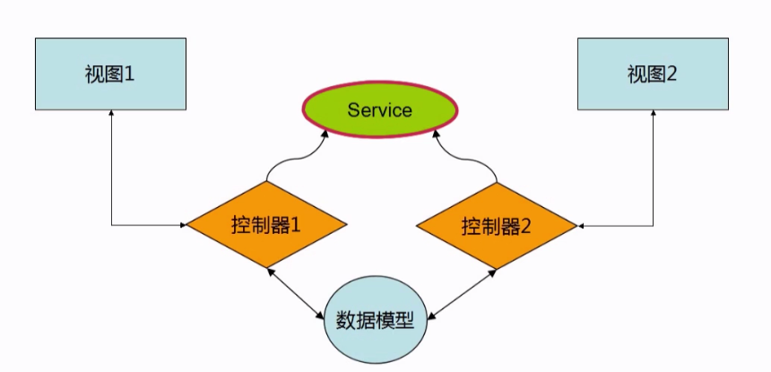
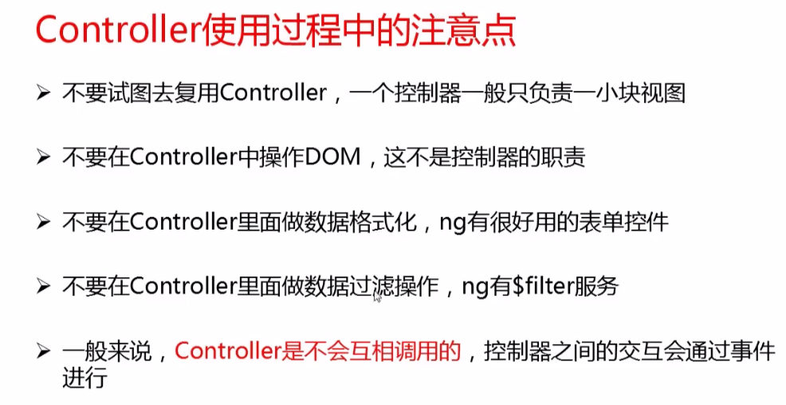
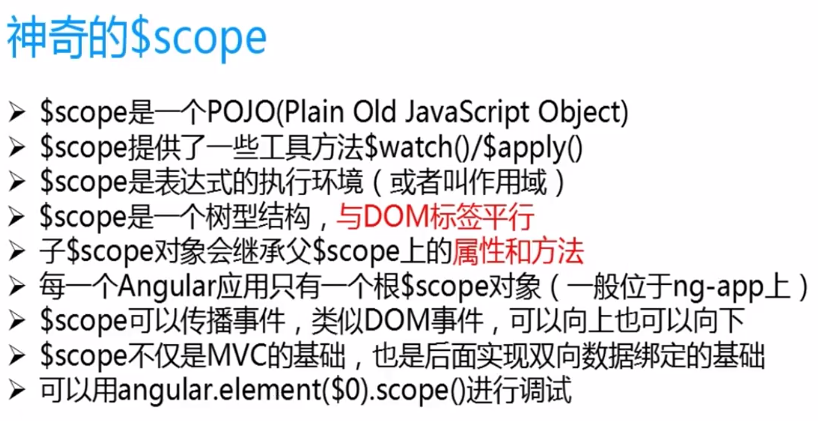
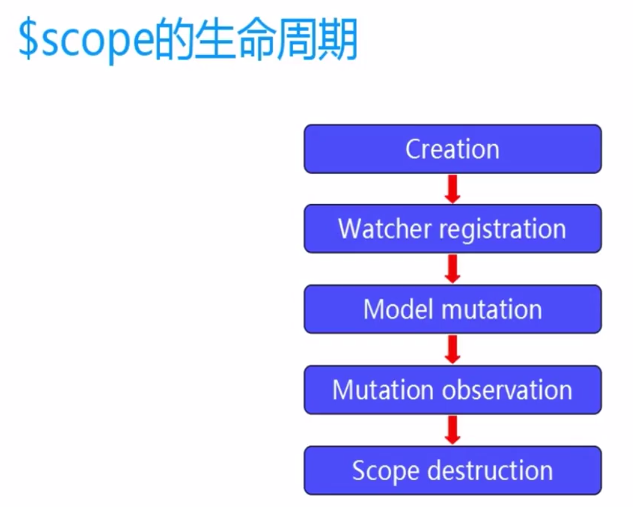
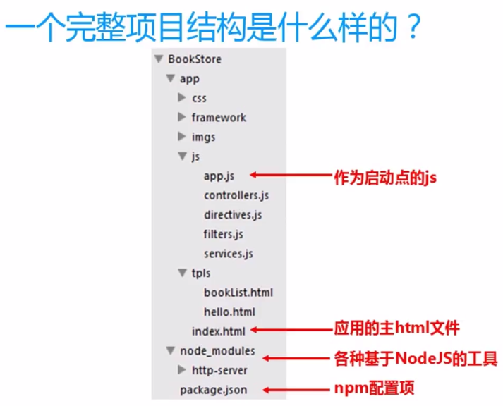
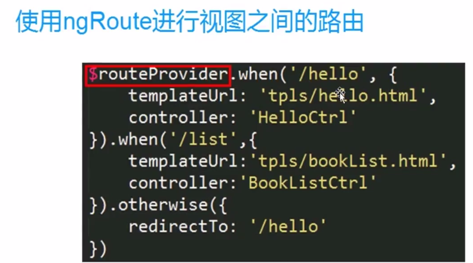
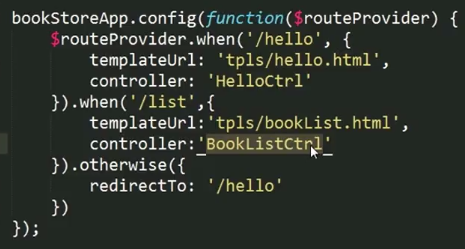

## MVC 
#mvc 借助$scope实现的，也就是说全部借助作用域实现的      不可继承控制器，应该是调用服务（控制器1，2有相同的部分时）

**操作DOM交给指令去做，不要再contrer中做，要不然性能会很低**

**不应该Controler之间相互调用，否则会有很强的耦合.控制器之间的交互可以通过$scope或数据模型上的事件进行，而Controler在内部监控这些事件**

# MODEL 数据模型  ng-model

[示例（一个html，没有js）](https://xiaoxiaohappy.github.io/AngularJS/app/examples/HelloAngular_TwoWayDataBinding.html)

在Angular加载完成之后，它会启动，找到<html ng-app>,ng-app指令表示这是Angular，
在这里面的ng-model是在根作用域下的，不需要初始化，绑定在$scope中
 
#复用视图  ng-repeat

# $scope是一个js对象

## 路由、模块、依赖注入

# 模块

Angular中的模块是一个集合，由模型、视图、控制器、过滤器、服务....构成，来实现某一个功能。

# 路由  

控制器来控制视图
（电视机的机顶盒是数据模型，电视屏幕是视图，遥控器是控制器）

这段代码写在上面的项目结构的app.js中

来调试的时候(这个#是锚点，防止向服务器传递，此例子我们没有写服务器)：
.../index#/list
.../index#/hello

