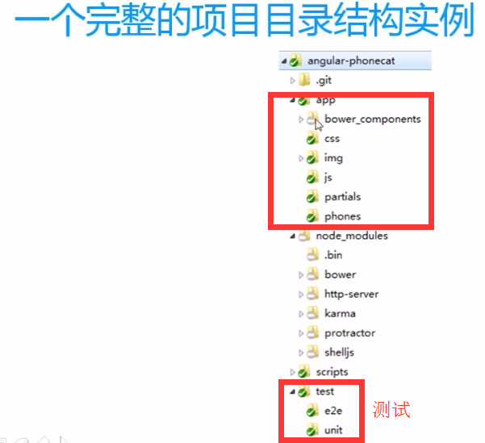

# 在Angular文件夹下（安装在当前目录下）
  npm install grunt

之后便安装上了文件夹node_modules中的内容
 
# 代码合并和混淆工具——[grunt](http://www.gruntjs.net/getting-started) 

js文件合并

js代码自动压缩

每次Ctrl+S的时候自动执行以上动作

还可以每次Ctrl+S自动运行单元测试、集成测试

# [依赖管理工具bower](http://bower.io)  可以不用

自动那个安装依赖的zujian

组件间的依赖检测

版本兼容性自动检测

